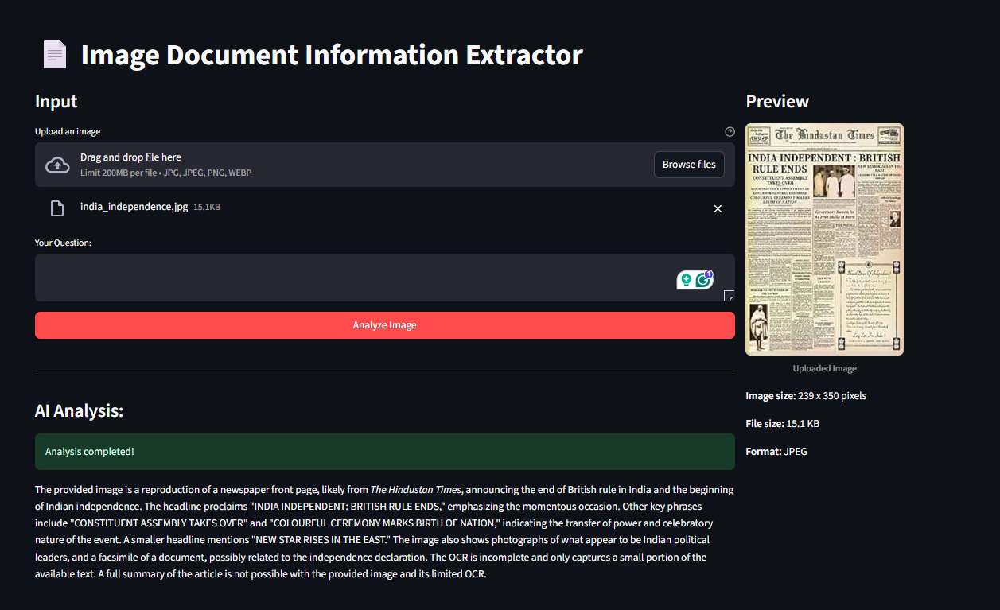

# Image understanding and QA AI


It uses **Google Generative AI (Gemini)** for image and language understanding

## 🖼️ Image Document QA Instructions

Follow these steps to get insights from your images using the AI:

**Step 1:** Upload an image file (JPG, PNG, WebP)

**Step 2:** Ask a specific question about the image, such as:
- "What text is visible in this image?"
- "Extract information from this receipt"
- "What is the main subject of this photo?"
- "Summarize the content of this document"

**Step 3:** Click "Analyze Image" to get AI-powered insights

**Tips for better results:**
- Use clear, high-resolution images
- Ask specific questions
- For documents, ensure text is clearly visible
- Try different phrasings if you don't get the desired result

    
## 🚀 Running the App

### 1. Streamlit Interface

Run the Streamlit app:
```bash
streamlit run app.py
```



